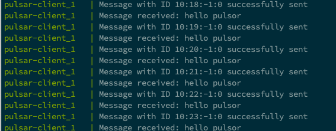

## Apache Pulsar 2.4.0


Apache Pulsar is an open-source distributed pub-sub messaging system originally created at Yahoo and now part of the Apache Software Foundation.

### Run apache pulsar (standalone)
```sh
docker run -p 6650:6650 -p 8080:8080 haritkumar/apache-pulsar:2.4.0
```

### Run apache pulsar-express (UI Manager) http://localhost:3000
```sh
docker run -p 3000:3000 haritkumar/pulsar-express:latest
```


### Run apache pulsar-client (Producer/Consumer)
```sh
docker run -p 9000:9000 haritkumar/pulsar-client:latest
```

### Use docker compose to run all nodes at once
```sh
docker-compose up
```

### Pulsar admin APIs
```html
http://localhost:8080/admin/v2/persistent/public/default/test-topic/stats
```

### Call producer api & check console
```html
http://localhost:9000/test-pulsar?content=hello%20pulsor
```


### Test Bulk Load
```sh
sh bulk-producer.sh 10000
```

#### Get docker container's IP
```sh
docker ps
docker inspect -f '{{range .NetworkSettings.Networks}}{{.IPAddress}}{{end}}' container_id
```